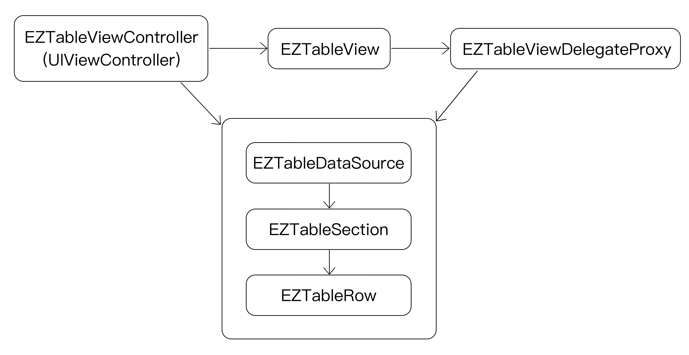
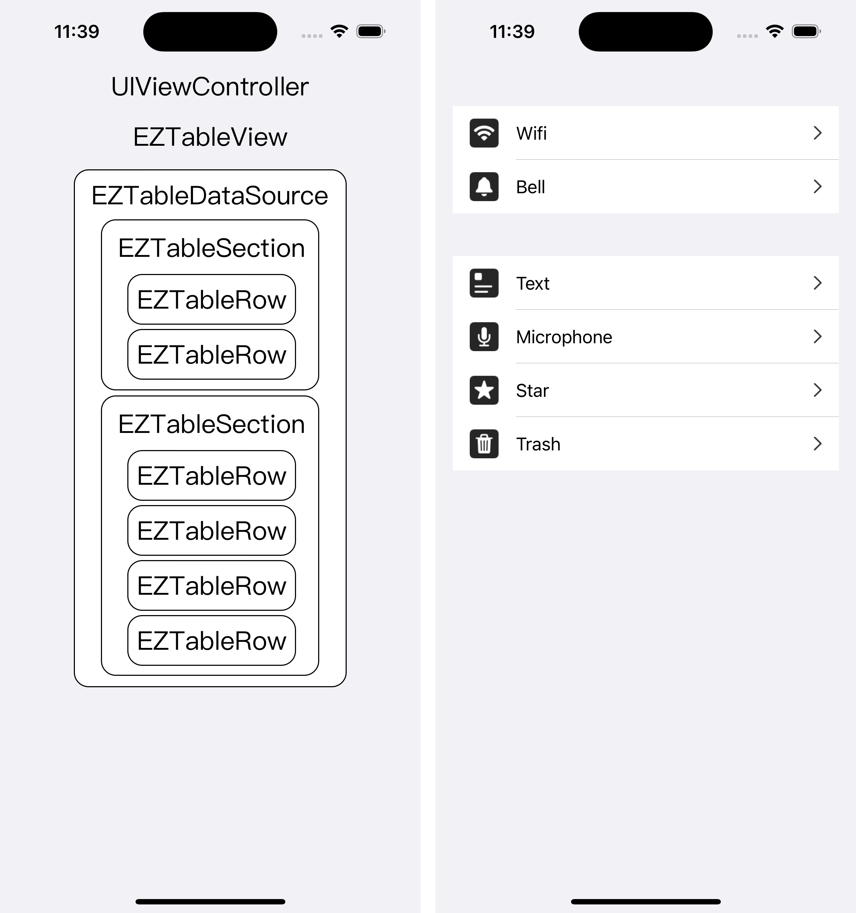

# EZTableKit



## Advantage
1. **Separate display and data processing**. Define display elements in `Cell`. Process data and refresh view in `Row`. 
2. **Flexible combination of Sections and Rows** make it easy to manage the data of tableView.

## Usage & Example

### Custom Row
The subclass of `EZTableViewCell` must be named: **The subclass name of `EZTableRow`  + "Cell"**. Or override `createNewTableViewCell` function to return custom cell.

```swift
class CustomRow : EZTableRow {
    
    override func updateCell(_ cell: UITableViewCell, indexPath: IndexPath) {
        super.updateCell(cell, indexPath: indexPath)
        // process data and update display
    }
}

class CustomRowCell : EZTableViewCell {
    
    override func cellDidCreate() {
        super.cellDidCreate()
        // custom display
    }
}
```

### Custom Section
Display header and footer. Or manage rows.

```swift
class DemoSection : EZTableSection {
    
    override func tableView(_ tableView: UITableView, viewForHeaderInSection section: Int) -> UIView? {
        // custom header
    }
}
```

### Create Sections and Rows

```swift
import EZTableKit

class DemoViewController : EZTableViewController {
    
    override func viewDidLoad() {
        super.viewDidLoad()
        tableView.backgroundColor = UIColor(red: 242 / 255.0, green: 241 / 255.0, blue: 245 / 255.0, alpha: 1)
        
        let array = [
            ["Wifi", "Bell"],
            ["Text", "Microphone", "Star", "Trash"],
        ]
        for titles in array {
            let section = DemoSection()
            dataSource.appendSection(section)
            
            for title in titles {
                let row = DemoRow(title: title)
                row.didSelectRowHandler = { tableView, indexPath in
                    // do something
                }
                section.appendRow(row)
            }
        }
        tableView.reloadData()
    }
}
```



## Installation

EZTableKit is available through [CocoaPods](https://cocoapods.org). To install
it, simply add the following line to your Podfile:

```ruby
pod 'EZTableKit'
```

## Author

Orisun, wang.orisun@icloud.com

## License

EZTableKit is available under the MIT license. See the LICENSE file for more info.
